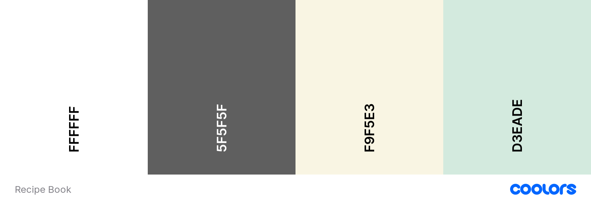

# Recipe Book

Recipe Book is an online app designed to build a community of 'foodies' and home cooks who share recipes and join in conversations. All users have access to browse and view published recipes but users must be registered to interact with content, join conversations and submit their own recipes. Registered users can easily submit their recipes to the site via a recipe submission form and can return to edit their recipes or delete them from the site. Each recipe is displayed on the site for other users to access after the author has requested publishing and it has been accepted by admin. Recipes can also be saved to the 'My Recipe Book' section where registered users can access saved recipes more easily and also access recipes they have written.

## User Experience (UX)

### User Stories

- As a site user I can view a paginated list of recipes so that I can select one to read.
- As a Site User I can click on a recipe so that I can read the full recipe.
- As a Site User / Admin I can view the number of likes on each recipe so that I can see which is the most popular.
- As a Site User I can save recipes so that I can make a collection the recipes I like.
- As a Site User I can like or unlike another user's recipe so that I can interact with the content.
- As a Site User I can leave comments on a recipe so that I can be involved in the conversation.
- As a Site User I can create recipes so that I can share them on the site.
- As a Site User I can publish and unpublish my recipes so that I can choose whether to share the recipe or not.
- As a Site User I can update/edit my recipes so that I can revise the recipe.
- As a Site User I can delete my created recipe so that I can remove the recipe from the site.
- As a user I can use a simple navigation menu so that easily find content.
- As a user I can view the navigation menu on any screen sizes so that navigating the site remains easy on all my devices.
- As a User I can easily find social media links so that I can find and interact with a community of app users.
- As a user I can sign up for an account so that I can save, share and interact with site content.
- As a user I can easily sign in to my account so that I can easily use the site features on return visits.
- As a user I can easily log out of my account so that I can keep my account secure.

- As a Site Admin I can approve or reject submitted user recipes so that I can manage the content of the site.

## Agile Development

This project was developed using Agile methodology which allowed me to iteratively and incrementally build my app, with flexibility to make changes to my design throughout the entire development process.

GitHub Issues and Projects were used to manage the development process. Each part of the app is divided into Epics_ which are broken down into User Stories with Tasks. An Epic represents a large body of work, such as a feature. The board view of the Project feature was used to display and manage my progress in the form of a 'kanban board'. The user stories were added to the 'Todo' column to be prioritised for development, moved to the 'In Progress' column to indicate development of the feature had begun and finally moved to the 'Done' column when the feature had been implemented and the acceptance criteria had been met.

User stories were prioritised using the MoSCoW prioritisation technique. Each user story was given one of the following labels:

- Must have - to indicate the user story is guaranteed to be delivered.
- Should have - to indicate the user story would add significant value but is not vital.
- Could have - to indicate the user story would have a small impact if left out.
- Won't have - to indicate the user story is not a priority in the current iteration.

GitHub milestones were also used to group related user stories together.

The Project link: (<https://github.com/users/VictoriaParkes/projects/2>)

## Design

### Structure

The Recipe Book app is designed with a simple structure to ensure the app is easy to use and navigate. Each page has a consistent layout to allow users to easily find the information they need. The app has a responsive design to ensure it can be clearly viewed on a wide range of devices. The navigation menu is available on all pages of the app to provide users with a consistent method to navigate the site. Bootstrap rows and columns have been used to provide a clean and uniform structure to the content of each page.

### Wireframes

- [base.html](docs/wireframes/base.png)
- [index.html](docs/wireframes/index.png)
- [browse.html](docs/wireframes/browse.png)
- [my_recipe_book.html](docs/wireframes/my_recipe_book.png)
- [create_edit_recipe.html](docs/wireframes/create_edit.png)
- [recipe_detail.html](docs/wireframes/recipe_detail.png)

### Colour Scheme

The colour scheme was chosen to complement the colours in the images without causing distraction and provide contrast for good readability of the information. The colour palette was created using [Coolors](https://coolors.co/).

### Typography

[Google Fonts](https://fonts.google.com/) was used to add the following fonts:

- 'Roboto' was used to provide a simple, clean and easy to read appearance.
- 'Reenie Beanie' was used as a decorative font for the logo.

### Imagery

The images and logo were chosen to reflect the content site, and provide a simple appearance without causing distraction.

### Icons

Icons were used as visual indicators for social media links, recipe likes, recipe saves, recipe preparation time and recipe servings.

All icons were sourced from [Font Awesome](https://fontawesome.com/).

## Features

### Navigation Menu

The navigation menu is featured on all pages to provide a consistent means of navigating the site. The menu provides links to 'Home' page, 'Browse' page, 'My Recipe Book' page, 'Create Recipe' page, a login link when the user is unauthenticated and a logout link when the user is authenticated. It is fully responsive, collapsing into a navbar toggle button which presents the navigation menu as a dropdown menu. A navbar brand and image features on the left of the navbar, providing an additional link to the 'Home' page.

### 'Home' Page

The 'Home' page features a hero section with a decorative image and a call to action which encourages unauthenticated users to sign up to the website or encourages authenticated users to browse recipes on the site. This page also features a section displaying the top three most liked recipes in a responsive column format as card that are links to the full recipe details.

### 'Browse' Page

The 'Home' page features a hero section with a decorative image and a call to action which encourages unauthenticated users to sign up to the website or encourages authenticated users to browse recipes on the site. This page also features a section displaying the top three most liked recipes in a responsive column format as card that are links to the full recipe details.

### 'My Recipe Book' Page

The 'My Recipe Book' page features two tabs to display either the recipes saved by the user or the recipes written by the user. Recipes are displayed as cards in in a responsive column format consistent with the 'Browse' page. If there are no recipes to display, a message informing the user that they have no saved/written any recipes yet is displayed. This page can only be accessed by authenticated users, unauthenticated users are redirected to the login page.

### Recipe Details Page

A recipe is displayed in full when the user clicks on a recipe card. The recipe image, title, author, number of likes, preparation time and number of servings are displayed in two columns on larger screens and one column on smaller screens. When viewed by authenticated user who is the author of the recipe, functionalities to edit and delete the recipe are available. An edit button will direct the user to create/edit recipe page which is populated with the current recipe details, where they can edit their recipe or cancel and return to the full recipe details page. A delete button will direct the user to a page asking the user to confirm they wish to delete the recipe, the recipe will be deleted from the database if the user confirms deletion or return to recipe details page if the users cancels deletion. When the recipe is viewed by an authenticated user who is not the author, functionalities to like and save the recipe are available. When the user likes the recipe the database is updated, along with the total number of likes on the page and the like button to confirm the action. When the recipe is saved the database is updated along with the save button to confirm the action.

If a recipe description was written by the recipe author it will be displayed.

The ingredients and method sections are displayed in two columns on larger screens and one column on smaller screens. The ingredients are displayed in a table format with a column for ingredient name and a column for ingredient amount, and the method is displayed as a numbered list.

Below the ingredients and method any tags entered by the author are displayed which are a link to the browse page where other recipes that contain the same tag are displayed. This feature allows users to more easily find similar recipes.

The commenting feature is also featured on the full recipe details page. Authenticated user are presented with a text input which can be used to submit a comment. Comments must be approved by admin before they will be displayed on the site. Upon submitting a comment a message is displayed inform the user that their comment has be successfully submitted and is awaiting approval. Approved comments for a recipe are displayed on the full recipe details page to all user of the site along with a total count of comments for the recipe.

### Create/Edit Recipe Page

A form in which authenticated user enter recipe details. The form consists of the following fields:

- a text input field for recipe title
- a text area for recipe description
- a choicefield for cooking time
- an integer field for number of servings
- a file upload field for an image, a default image is used if user does not upload an image
- a text input field for tags
- a multiwidget comprised of two text input fields for ingredient name and amount
- a text area for method steps
- a check box input for publication request

Django formsets are used for ingredient and method inputs giving the user the ability to add additional form inputs to add as many individual ingredients and method steps as needed.

The form features a submit button to submit a recipe and a cancel button to return to the 'browse' page without submitting the form.

### User Authentication

### Admin

### Future features
