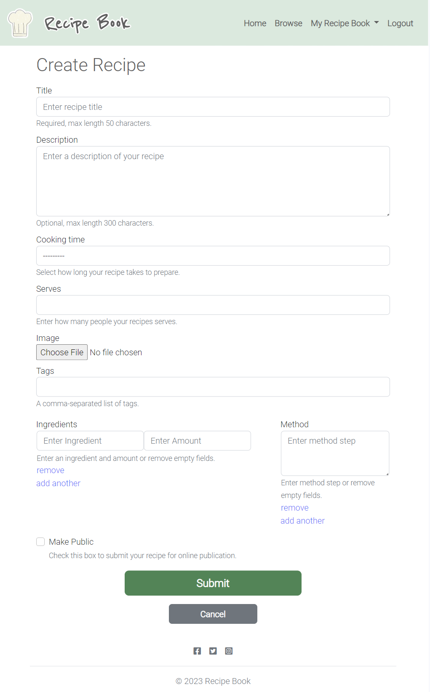

# Recipe Book


Recipe Book is an online app designed to build a community of 'foodies' and home cooks who share recipes and join in conversations. All users have access to browse and view published recipes but users must be registered to interact with content, join conversations and submit their own recipes. Registered users can easily submit their recipes to the site via a recipe submission form and can return to edit their recipes or delete them from the site. Each recipe is displayed on the site for other users to access after the author has requested publishing and it has been accepted by admin. Recipes can also be saved to the 'My Recipe Book' section where registered users can access saved recipes more easily and also access recipes they have written.

[The deployed website can be found here](https://vjp-recipe-book-821f4ac9817f.herokuapp.com/)

## Contents

1. [User Experience (UX)](#1-user-experience-ux)
2. [Agile Development](#2-agile-development)
3. [Design](#3-design)
4. [Features](#4-features)
5. [Technologies Used](#5-technologies-used)
6. [Local Development and Deployment](#6-local-development-and-deployment)
7. [Testing](#7-testing)
8. [Credits](#8-credits)

## 1. User Experience (UX)

### User Stories

- As a site user I can view a paginated list of recipes so that I can select one to read.
- As a Site User I can click on a recipe so that I can read the full recipe.
- As a Site User / Admin I can view the number of likes on each recipe so that I can see which is the most popular.
- As a Site User I can save recipes so that I can make a collection the recipes I like.
- As a Site User I can like or unlike another user's recipe so that I can interact with the content.
- As a Site User I can leave comments on a recipe so that I can be involved in the conversation.
- As a Site User I can create recipes so that I can share them on the site.
- As a Site User I can publish and unpublish my recipes so that I can choose whether to share the recipe or not.
- As a Site User I can update/edit my recipes so that I can revise the recipe.
- As a Site User I can delete my created recipe so that I can remove the recipe from the site.
- As a user I can use a simple navigation menu so that easily find content.
- As a user I can view the navigation menu on any screen sizes so that navigating the site remains easy on all my devices.
- As a User I can easily find social media links so that I can find and interact with a community of app users.
- As a user I can sign up for an account so that I can save, share and interact with site content.
- As a user I can easily sign in to my account so that I can easily use the site features on return visits.
- As a user I can easily log out of my account so that I can keep my account secure.

- As a Site Admin I can approve or reject submitted user recipes so that I can manage the content of the site.

## 2. Agile Development

This project was developed using Agile methodology which allowed me to iteratively and incrementally build my app, with flexibility to make changes to my design throughout the entire development process.

GitHub Issues and Projects were used to manage the development process. Each part of the app is divided into Epics_ which are broken down into User Stories with Tasks. An Epic represents a large body of work, such as a feature. The board view of the Project feature was used to display and manage my progress in the form of a 'kanban board'. The user stories were added to the 'Todo' column to be prioritised for development, moved to the 'In Progress' column to indicate development of the feature had begun and finally moved to the 'Done' column when the feature had been implemented and the acceptance criteria had been met.


User stories were prioritised using the MoSCoW prioritisation technique. Each user story was given one of the following labels:

- Must have - to indicate the user story is guaranteed to be delivered.
- Should have - to indicate the user story would add significant value but is not vital.
- Could have - to indicate the user story would have a small impact if left out.
- Won't have - to indicate the user story is not a priority in the current iteration.

GitHub milestones were also used to group related user stories together.

[The Project Kanban Board](https://github.com/users/VictoriaParkes/projects/2)

## 3. Design

### Structure

The Recipe Book app is designed with a simple structure to ensure the app is easy to use and navigate. Each page has a consistent layout to allow users to easily find the information they need. The app has a responsive design to ensure it can be clearly viewed on a wide range of devices. The navigation menu is available on all pages of the app to provide users with a consistent method to navigate the site. Bootstrap rows and columns have been used to provide a clean and uniform structure to the content of each page.

### Wireframes

- [base.html](docs/wireframes/base.png)
- [index.html](docs/wireframes/index.png)
- [browse.html](docs/wireframes/browse.png)
- [my_recipe_book.html](docs/wireframes/my_recipe_book.png)
- [create_edit_recipe.html](docs/wireframes/create_edit.png)
- [recipe_detail.html](docs/wireframes/recipe_detail.png)

### Colour Scheme


The colour scheme was chosen to complement the colours in the images without causing distraction and provide contrast for good readability of the information. The colour palette was created using [Coolors](https://coolors.co/).

### Typography

[Google Fonts](https://fonts.google.com/) was used to add the following fonts:

- 'Roboto' was used to provide a simple, clean and easy to read appearance.
- 'Reenie Beanie' was used as a decorative font for the logo.

### Imagery

The images and logo were chosen to reflect the content site, and provide a simple appearance without causing distraction.

### Icons

Icons were used as visual indicators for social media links, recipe likes, recipe saves, recipe preparation time and recipe servings.

All icons were sourced from [Font Awesome](https://fontawesome.com/).

## 4. Features

### Navigation Menu

The navigation menu is featured on all pages to provide a consistent means of navigating the site. The menu provides links to 'Home' page, 'Browse' page, 'My Recipe Book' page, 'Create Recipe' page, a login link when the user is unauthenticated and a logout link when the user is authenticated. It is fully responsive, collapsing into a navbar toggle button which presents the navigation menu as a dropdown menu. A navbar brand and image features on the left of the navbar, providing an additional link to the 'Home' page.


### 'Home' Page

The 'Home' page features a hero section with a decorative image and a call to action which encourages unauthenticated users to sign up to the website or encourages authenticated users to browse recipes on the site. This page also features a section displaying the top three most liked recipes in a responsive column format as cards that are links to the full recipe details.


### 'Browse' Page

The 'Browse' page features a paginated list of all currently published recipes displayed as cards. Clicking anywhere on a recipe card will display the full recipe details. This page is displayed in a fully responsive column format. If there are no published recipes available for display, text reading 'There are no recipes yet' is displayed.


### 'Saved Recipes' Page

The 'Saved Recipes' page can be accessed by authenticated users only and displays a paginated list of all currently published recipes that the user has saved as cards. Clicking anywhere on a recipe card will display the full recipe details. This page is displayed in a fully responsive column format. If the user has no saved recipes, text reading 'You have not saved any recipes yet' is displayed. This page reuses the 'Browse' template. Unauthenticated users are redirected to the login page.


### 'My Recipes' Page

The 'My Recipes' page can be accessed by authenticated users only and displays a paginated list of all recipes written by the user as cards. Clicking anywhere on a recipe card will display the full recipe details. This page is displayed in a fully responsive column format. If the user has not written any recipes, text reading 'You have not written any recipes yet' is displayed. This page reuses the 'Browse' template. Unauthenticated users are redirected to the login page.


### Recipe Details Page

A recipe is displayed in full when the user clicks on a recipe card. The recipe image, title, author, number of likes, preparation time and number of servings are displayed in two columns on larger screens and one column on smaller screens. When viewed by authenticated user who is the author of the recipe, functionalities to edit and delete the recipe are available. An edit button will direct the user to create/edit recipe page which is populated with the current recipe details, where they can edit their recipe or cancel and return to the full recipe details page. A delete button will direct the user to a page asking the user to confirm they wish to delete the recipe, the recipe will be deleted from the database if the user confirms deletion or return to recipe details page if the users cancels deletion. When the recipe is viewed by an authenticated user who is not the author, functionalities to like and save the recipe are available. When the user likes the recipe the database is updated, along with the total number of likes on the page and the like button to confirm the action. When the recipe is saved the database is updated along with the save button to confirm the action.

If a recipe description was written by the recipe author it will be displayed.

The ingredients and method sections are displayed in two columns on larger screens and one column on smaller screens. The ingredients are displayed in a table format with a column for ingredient name and a column for ingredient amount, and the method is displayed as a numbered list.

Below the ingredients and method any tags entered by the author are displayed which are a link to the browse page where other recipes that contain the same tag are displayed. This feature allows users to more easily find similar recipes.

The commenting feature is also featured on the full recipe details page. Authenticated user are presented with a text input which can be used to submit a comment. Comments must be approved by admin before they will be displayed on the site. Upon submitting a comment a message is displayed inform the user that their comment has be successfully submitted and is awaiting approval. Approved comments for a recipe are displayed on the full recipe details page to all user of the site along with a total count of comments for the recipe.


### Create/Edit Recipe Page

A form in which authenticated user enter recipe details. The form consists of the following fields:

- a text input field for recipe title
- a text area for recipe description
- a choicefield for cooking time
- an integer field for number of servings
- a file upload field for an image, a default image is used if user does not upload an image
- a text input field for tags
- a multiwidget comprised of two text input fields for ingredient name and amount
- a text area for method steps
- a check box input for publication request

Django formsets and a jquery plugin called django-dynamic-formset are used for ingredient and method inputs giving the user the ability to add additional form inputs to add as many individual ingredients and method steps as needed.

The form features a submit button to submit a recipe and a cancel button to return to the 'browse' page without submitting the form. Upon successful form submission the user is returned to the 'My Recipes' page.

When editing a recipe the form fields are prepopulated with the existing recipe details ready to be edited by the user. Django's UserPassesTestMixin was used to limit access to logged-in users that pass a test to check that they are the author of the recipe. This ensures that only the recipe author can edit any recipe.



### User Authentication

The app uses the Django Allauth package to handle user authentication and enable authenticated users to utilise the CRUD functionalities. The package provides a set of views and templates to handle user registration, login and logout. Defensive programming has been used throughout the site to prevent users accessing pages when they don't have the relevant permissions. To access the admin panel the user requires 'superuser' or 'staff status' permission status. Django's LoginRequired mixin is used to limit access to anonymous users and redirect them to the login page when they try to view content for which they require an account to access. Content is protected from unauthorised changes with the use of user_passes_test decorator, for example recipes can only be edited by the author of the recipe. This decorator causes unauthorised users to be redirected to a 403 error page informing the user they are not permitted to perform the action.


### Admin Panel

Django's admin panel can be accessed by 'superusers' and users with the permission of 'staff status'. The admin panel is used to manage site content by setting the approval status of recipes and comments. A list of all tags entered can also be viewed form the admin panel and can be deleted , edited and added to if needed. Each data model is registered with the admin using the register decorator so they are easily accessed and managed.

### Error Pages

Custom error pages were created for the 400, 403, 404, and 500 errors. These pages give the user context of the error that has occurred. The navigation menu is still available to the user for continued app use.


### Data Models

The Recipe Book app uses a relational database to store and manage data. The relational database management system software used for this project is [PostgreSQL](https://www.postgresql.org/) which is hosted on the cloud service [ElephantSQL](https://www.elephantsql.com/).


#### Recipe Model

Title - a CharField with a maximum of 50 characters and a help text reading 'Required, max length 50 characters.' which is displayed under the form input field.

Slug - an autopopulated field that uses django-autoslug, a django library that provides an improved slug field which can automatically populate itself from another field, preserve uniqueness of the value and use custom slugify() functions for better i18n.

Author - a ForeignKey linking the recipe to the user model of the user who created it.

Recipe_image - a CloudinaryField which contains the URL to the image that is stored on the Cloudinary server.

Tags - the tags field uses a django application called django-taggit which provides a tag model and taggeditem model. It uses the class TaggableManager() to manage the relationships between the recipe and the associated tags.

Description - a TextField with a maximum of 300 characters and a help text reading 'Optional, max length 300 characters.' which is displayed under the form input field. This field is not required.

Cooking_time - a CharField with a maximum of 50 charaters and a help text reading 'Select how long your recipe takes to prepare.' which is displayed under the form input field. The input is selected from the choices dropdown.

Serves - an IntegerField with a help text reading 'Enter how many people your recipes serves.' which is displayed under the form input field.

Ingredients - a JSONField. The ingredient input values are converted into a JSON string when the form is submitted.

Method - a JSONField. The method input values are converted into a JSON string when the form is submitted.

Created_on - a DateTimeField that autopopulates with the current date and time when a recipe is created.

Updated_on - a DateTimeField that autopopulates and updates with the current date and time when a recipe is updates.

Publish_request - a BooleanField which which is set to True when the user checks the 'Make Public' check box, defaults to false when box is left unchecked. A help text reading 'Check this box to submit your recipe for online publication.' is displayed under the form input.

Approval_status - a CharField with a maximum of 50 characters. Defaults to 'Unpublished' if the user does not check the 'Make Public' check box or defaults to 'Pending Approval' when the user oes check the 'Make Public' check box. The field is updated by admin to approve or reject the recipe.

Likes - a ManyToManyField linking user models to recipes that user has liked.

#### Comment Model

The comment model was taken from Code Institute's 'Codestar Blog'.

Recipe - a ForeignKey linking the comment to the recipe it is associated with.

Name - a CharField with a maximum of 150 characters. This field is populated with the user's username.

Body - a TextField to store the comment submitted.

Created_on - a DateTimeField that autopopulates with the current date and time when a comment is submitted.

Approved - a BooleanField that defaults to false and is updated to true by admin when the comment is approved.

#### Saves Model

Recipe - a ForeignKey referencing the recipe that has been saved.

User - a ForeignKey referencing the user that has saved the recipe.

Saved_on - a DateTimeField that autopopulates with the current date and time when the recipe was saved.

#### Entity Relationship Diagram

The Entity Relationship Diagram below shows the structure of the database and the relationships between the tables.


### Static File Storage

The app uses the Cloudinary cloud service to store static files such as images, CSS, and JavaScript files. To store the recipe images uploaded by user when creating a recipe, the Cloudinary field uses the Cloudinary API to upload the images to the Cloudinary server and store the image URL in the database.


### Future features

- Add functionality for authenticated users to give recipes a star rating, this would give further quick and easy user interaction.
- Add search functionality to search for recipes by keyword. This would make it easier for user to find content they are interested in and improve user experience.
- Add a profile page feature for users to introduce themselves to the community and give authenticated users a place to share information about themselves.

## 5. Technologies Used

### Languages

- [HTML5](https://en.wikipedia.org/wiki/HTML5)
- [CSS3](https://en.wikipedia.org/wiki/CSS)
- [JavaScript](https://en.wikipedia.org/wiki/JavaScript)
- [Python](https://en.wikipedia.org/wiki/Python_(programming_language))

### Frameworks, Libraries and Packages

- [Django 3.2](https://docs.djangoproject.com/en/3.2/)
- [Bootstrap 5](https://getbootstrap.com/)
- [jQuery 3.7.1](https://releases.jquery.com/)
- [Font Awesome 5.15.4](https://fontawesome.com/)
- [Google Fonts](https://fonts.google.com/)
- [django-crispy-forms](https://django-crispy-forms.readthedocs.io/en/latest/)
- [cripsy-bootstrap5](https://github.com/django-crispy-forms/crispy-bootstrap5)
- [django-allauth](https://django-allauth.readthedocs.io/en/latest/)
- [django-dynamic-formset](https://github.com/elo80ka/django-dynamic-formset)
- [django-autoslug](https://django-autoslug.readthedocs.io/en/stable/)
- [django-taggit](https://django-taggit.readthedocs.io/en/stable/)
- [coverage](https://coverage.readthedocs.io/en/7.2.7/)

### Tools

- [Git](https://git-scm.com/)
- [GitHub](https://github.com/)
- [CodeAnywhere](https://app.codeanywhere.com/)
- [Heroku](https://heroku.com/)
- [ElephantSQL](https://www.elephantsql.com/)
- [Cloudinary](https://cloudinary.com/)
- [Balsamiq](https://balsamiq.com/)
- [Lucidchart](https://www.lucidchart.com/pages)
- [Coolors](https://coolors.co/)
- [CloudConvert](https://cloudconvert.com/)
- [Tiny PNG](https://tinypng.com/)
- [Am I Responsive](https://ui.dev/amiresponsive)
- [favicon.io](https://favicon.io/)
- [Code Institute Python Linter](https://pep8ci.herokuapp.com/)
- [JSHint](https://jshint.com/)
- [Coverage](https://coverage.readthedocs.io/)

## 6. Local Development and Deployment

### Local Development

#### Forking the Repository

- Log in to GitHub.
- Go to the repository for this project (<https://github.com/VictoriaParkes/recipe-book>).
- In the top-right corner of the page, click "Fork".
- Under "Owner", select an owner for the repository from the dropdown menu.
- Optionally, in the "Description" field, type a description of your fork.
- To copy the main branch only, select the "Copy the main branch only" check box. If you do not select this option, all branches will be copied into the new fork.
- Click "Create fork"

#### Cloning Your Forked Repository

- Log-in to GitHub.com, navigate to your fork of the repository.
- Above the list of files, click Code.
- Copy the URL for the repository.
  - To clone the repository using HTTPS, under "Clone with HTTPS", click the "Copy" icon.
  - To clone the repository using an SSH key, including a certificate issued by your organization's SSH certificate authority, click SSH, then click the "Copy" icon.
  - To clone a repository using GitHub CLI, click Use GitHub CLI, then click the "Copy" icon.
- Open Git Bash
- Change the current working directory to the location where you want the cloned directory.
- Type git clone, and then paste the URL you copied earlier.
- Press Enter. Your local clone will be created.

For more details about forking and cloning a repository, please refer to [GitHub documentation](https://docs.github.com/en/get-started/quickstart/fork-a-repo).

#### Install Dependencies

Use the `pip install -r requirements.txt` command to install all of the Python modules and packages listed in your requirements.txt file.

#### Create your env.py

- In your project workspace, create a file called env.py and make sure this file is included in the .gitignore file.
- Add the following code:

```python
import os

os.environ["DATABASE_URL"]='<copiedURL>'
os.environ['SECRET_KEY'] = '<ADD YOUR SECRET KEY HERE>'
os.environ['CLOUDINARY_URL'] = '<API ENVIRONEMENT VARIABLE>'

```

- Replace `<ADD YOUR SECRET KEY HERE>` in the SECRET_KEY environment variable with your own secret key.
- Save the file.

#### Create a Database

- Create an account and log in with ElephantSQL.com.
- From the dashboard click “Create New Instance”.
- Set up your plan
  - Give your plan a Name
  - Select a plan tier
  - You can leave the Tags field blank
- Select “Select Region”
- Select a data center near you
- Then click “Review”
- Check your details are correct and then click “Create instance”
- Return to the ElephantSQL dashboard and click on the database instance name for this project
- In the URL section, click the copy icon to copy the database URL
- In your env.py file replace `<copiedURL>` in the DATABASE_URL environment variable with the copied URL.
- Save the file.

#### Set Up Cloudinary

- Create an account and log in with Cloudinary.com.
- In the dashboard copy your API Environment variable.
- In your env.py file replace `<API ENVIRONEMENT VARIABLE>` in the CLOUDINARY_URL environment variable with the copied API Environment variable.
- Save the file.

### Deployment

- The requirements.txt file in the project was updated to include details on the project dependencies. Steps to do this are :
  - Enter the following command at the terminal prompt : "pip3 freeze > requirements.txt"
  - Commit changes to requirements.txt and push to GitHub.
- Log in to Heroku, create an account if necessary.
- From the Heroku dashboard, click "Create new app". For a new account a button will be displayed on screen, if you already have one or more apps created a link to this function is located in the "New" dropdown menu at the top right of the screen.
- On the Create New App page, enter a unique name for the application and select region. Then click Create app.
- Select the "settings" tab and click the "Reveal Config Vars" button.
- Enter the following values into the specified fields and click "Add":

    | KEY | VALUE |
    |-----|-------|
    | CLOUDINARY_URL | paste your API Environment variable copied from the Cloudinary dashboard |
    | DATABASE_URL | paste the URL copied from ElephantSQL dashboard |
    | SECRET_KEY | paste your secret key |

- Select the "Deploy" tab.
- Select GitHub as the Deployment Method and click "Connect to GitHub".
- Enter the name of your GitHub repository in the search bar and click "Search".
- Click the "Connect" button to link your GitHub repository with your Heroku app.
- Scroll down the page and choose to either Automatically Deploy each time changes are pushed to GitHub, or Manually deploy.
- The application can be run from the Application Configuration page by clicking on the Open App button.

## 7. Testing

[Chrome DevTools](https://developer.chrome.com/docs/devtools/) was frequently utilised in the development of the website to manipulate and test features as they were added to the project, to test responsiveness and for debugging purposes.

### Manual Functionality Testing

[See Functionality Testing Document](docs/testing/functionality-testing.md)

### Browser Compatibility

The website was tested for functionality on different browsers (Chrome, Firefox and Edge) and found to be fully functional on them all.

### Device Compatability and Responsiveness

The app was tested on the following devices, using Chrome Developer Tools:

- iPhone SE
- iPhone 12 Pro
- Pixel 5
- Samsung Galaxy S8+
- Samsung Galaxy S20 Ultra
- iPad Air
- iPad Mini
- Surface Pro 7
- Surface Duo
- Galaxy Fold
- Samsung Galaxy A51
- Nest Hub
- Nest Hub Max
- iPad
- iPadPro

## W3C HTML Validator Testing

The [W3C Markup Validation Service](https://validator.w3.org/) was used to validate the HTML files.


## W3C CSS Validator Testing

The [W3C CSS Validation Service](https://jigsaw.w3.org/css-validator/) was used to validate the CSS in the stylesheet `style.css`.


### Python Linter

The Code Institute Python Linter was used to validate and format the python files neatly. All errors were fixed and no errors were found in the final tests.


### JSHint JavaScript Validator Testing

[JSHint](https://jshint.com/) was used to validate the file script.js. All errors were fixed and no errors were found in the final tests.


### Automated Testing

#### Unit Tests

The automated tests were written using Django's built-in testing framework which use Python's unittest module. By default Django uses SQLite for the app database, this was used for development purposes and performing automated tests. The test files can be found in the app directory.


#### Coverage

The coverage report was generated using the [Coverage](https://coverage.readthedocs.io/) tool.


### Testing User Stories

| User Story | Acceptance Criteria | Status |
|----------|-----------|----------------|
| As a site user I can view a paginated list of recipes so that I can select one to read. | <ol><li>Recipes can be viewed in list format</li><li>Page is responsive</li><li>List is paginated</li></ol> | COMPLETE |
| As a Site User I can click on a recipe so that I can read the full recipe. | <ol><li>Recipe details displayed clearly</li><li>Like button toggles liked/unliked</li><li>Number of likes displayed with like button</li><li>Save button toggles saved/unsaved</li><li>Tags link to other recipes with same tag</li></ol> | COMPLETE |
| As a Site User / Admin I can view the number of likes on each recipe so that I can see which is the most popular. | <ol><li>Recipe likes are clearly indicated</li><li>Total count is displayed</li></ol> | COMPLETE |
| As a Site User I can save recipes so that I can make a collection the recipes I like. | <ol><li>User can save recipes</li><li>Saved recipes can be viewed in list format</li><li>Saved recipes can be opened and viewed in full</li><li>Saved recipes can be 'unsaved'</li></ol> | COMPLETE |
| As a Site User I can like or unlike another user's recipe so that I can interact with the content. | <ol><li>Like button likes/unlikes recipe</li><li>Total recipe likes visible</li></ol> | COMPLETE |
| As a Site User I can leave comments on a recipe so that I can be involved in the conversation. | <ol><li>Comments can be left by logged in users</li><li>Comments can be viewed by all users</li><li>Comments must be approved by admin before being displayed to users</li></ol> | COMPLETE |
| As a Site User I can create recipes so that I can share them on the site. | <ol><li>Create recipe form is available to registered user when logged in.</li><li>Form contains inputs for Title, description, image, ingredients, method, tags, publish request, request publishing and submit.</li><li>Form submission saves recipe to database.</li><li>User input errors are addressed with error messages.</li></ol> | COMPLETE |
| As a Site User I can publish and unpublish my recipes so that I can choose whether to share the recipe or not. | <ol><li>Check box clearly visible in form.</li><li>Checked sets publish request value to true and approval status to pending approval.</li><li>Unchecked sets publish request to false and approval status to unpublished.</li></ol> | COMPLETE |
| As a Site User I can update/edit my recipes so that I can revise the recipe. | <ol><li>Edit recipe button takes user to edit recipe form.</li><li>Edit recipe form is prepopulated with current recipe data.</li><li>Edited recipe data is replaces current recipe data when saved.</li><li>Recipe requires approval if publishing is requested.</li><li>Recipe approval status is set to 'unpublished' if publishing is not requested.</li></ol> | COMPLETE |
| As a Site User I can delete my created recipe so that I can remove the recipe from the site. | <ol><li>Logged in users can delete the recipes they have written.</li><li>Recipes can't be deleted by users who are not the author.</li><li>Deleted recipes are removed from the database.</li></ol> | COMPLETE |
| As a Site Admin I can unpublish recipes so that manage content on the site. | <ol><li>Recipe approval status can be edited by admin.</li></ol> | COMPLETE |
| As a user I can use a simple navigation menu so that easily find content. | <ol><li>Navbar present.</li><li>Each page can be reached from navbar.</li><li>Logo is link to home page.</li></ol> | COMPLETE |
| As a user I can view the navigation menu on any screen sizes so that navigating the site remains easy on all my devices. | <ol><li>Navbar content collapses behind a button on smaller screens.</li></ol> | COMPLETE |
| As a User I can easily find social media links so that I can find and interact with a community of app users. | <ol><li>Social media links are clearly visible in footer.</li><li>All links open social media site in a new tab.</li></ol> | COMPLETE |
| As a user I can sign up for an account so that I can save, share and interact with site content. | <ol><li>Sign up page is easily accessed.</li><li>Submission of sign up form creates user account.</li><li>Sign up page is styled for ease of use and readability.</li></ol> | COMPLETE |
| As a user I can easily sign in to my account so that I can easily use the site features on return visits. | <ol><li>Sign in page is easily accessed.</li><li>Submission of sign in form signs the user into their account.</li><li>Sign in page is styled for ease of use and readability.</li></ol> | COMPLETE |
| As a user I can easily log out of my account so that I can keep my account secure. | <ol><li>Log out page is easily accessed.</li><li>Submission of log out form logs user out of their account.</li><li>Log out page is styled for ease of use and readability.</li></ol> | COMPLETE |
| As a Site Admin I can approve or reject submitted user recipes so that I can manage the content of the site. | <ol><li>Approval status can be set in admin view.</li><li>Recipes can be filtered by approval status</li></ol> | COMPLETE |

### Bugs Encountered

1. When viewing recipe details as anonymous user, TypeError received ('AnonymousUser' object not iterable). Added 'if' statement to view to check if user is authenticated before querying the 'Saves' database for matching user.
2. User images were not being submitted, added class `enctype="multipart/form-data"` to form to allow files to be uploaded.
3. Refactored my recipe book pages to make paginating and redirecting to 'my recipes' after creating, editing and deleting recipes easier.
4. Removing all ingredients or method formset from recipe form submitted empty list for model instance, added clause to save recipe but not submit for publication if ingredients or method not entered.
5. Visiting the admin panel using the admin url without a trailing slash resulted in the return of a 404 error. This was caused by the application attempting to match the given url to the recipe details url pattern which uses the slug of the selected recipe. The error was fixed by using `recipe/<slug:slug>` in the recipe detail url pattern instead of `<slug:slug>`.

## 8. Credits

### Code

[Django Docs](https://docs.djangoproject.com/en/3.2/), [W3Schools](https://www.w3schools.com/) and [Bootstrap Docs](https://getbootstrap.com/docs/5.3/getting-started/introduction/) were frequently referred to in the development of this website:

- Code from Code Institute's CodeStar blog walkthrough project was used and modified to create the commenting feature.
- Forms were styled using [django-crispy-forms docs](https://django-crispy-forms.readthedocs.io/en/1.14.0/index.html).
- The multiwidget and multivalue fields in the recipe form were created using [Python – Django: MultiValueField and MultiWidget](https://itecnote.com/tecnote/python-django-multivaluefield-and-multiwidget/) and [Handling multiple input values for single Django form field](https://coderwall.com/p/kq1d5a/handling-multiple-input-values-for-single-django-form-field).
- The dynamic functionality of the formsets in to recipe form were created using [Adding forms dynamically to a Django formset](https://medium.com/all-about-django/adding-forms-dynamically-to-a-django-formset-375f1090c2b0) and [django-dynamic-formset](https://github.com/elo80ka/django-dynamic-formset).
- Extra context and querysets were added to views using [When to use get, get_queryset, get_context_data in Django?](https://medium.com/@hassanraza/when-to-use-get-get-queryset-get-context-data-in-django-952df6be036a).
- Automated tests to assert queryset equality were created using [Testing Equality of Django QuerySets: A Guide](https://copyprogramming.com/howto/how-do-i-test-django-querysets-are-equal).
- The custom error pages were created using advice from my mentor Brian Macharia.
- The user images failing to upload bug was fixed using [W3Schools](https://www.w3schools.com/tags/att_form_enctype.asp).
- The admin panel 404 error was fixed using [Stack Overflow](https://stackoverflow.com/questions/9463173/append-slash-not-working).

### Content

The recipes featured on the app were sourced from [BBC Good Food](https://www.bbcgoodfood.com/).

### Media

The images featured on the app were sourced from [rawpixel](https://www.rawpixel.com/):

- [Logo](https://www.rawpixel.com/image/2393591/free-illustration-png-chef-cook-hat-cooking)
- [Hero Image](https://www.rawpixel.com/image/2395669/free-illustration-png-accessory-apron-bakery)
- [Default Recipe Image](https://www.rawpixel.com/image/2393629/free-illustration-vector-hand-drawn-plate-dome-cap)

### Acknowledgements

I would like to thank Brian Macharia, my Code Institute mentor, for his helpful feedback and advice.
